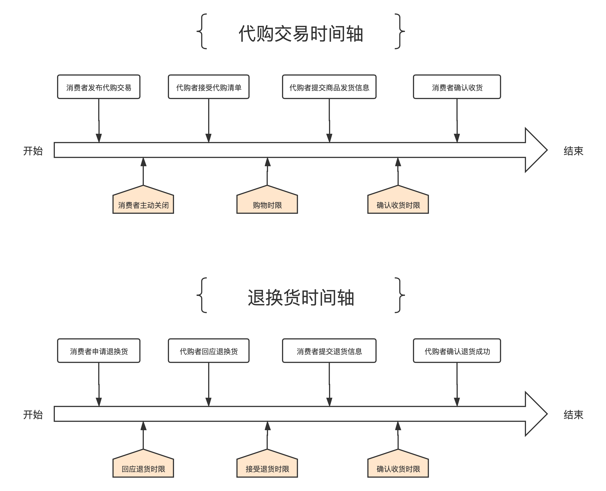

# 代购交易模块设计

## 概述

消费者发布一笔代购交易单，并锁定与购物车等额的加密货币，并提供小费作为报酬。代购者接受交易，完成代购过程，最终获得锁定中的加密货币和小费。

## 业务流程

### 角色

- **消费者**。发布代购交易单，使用加密货币作为支付方式，并提供小费作为报酬。
- **代购者**。接受代购交易单，在电商平台完成实际商品买卖，让商家把商品发货给真实消费者。

> 用户在平台不断发生代购交易，系统会记录相当庞大的订单数据。如果把订单数据存储在链上，将会产生非常大的存储成本。因此我们会开发一个链下的订单管理系统，用于存储详细的购物订单信息，发货信息，发票信息，退货信息，这些信息会进行序列化并哈希后才存储到链上。该系统是部署在我们管理的中心化服务器，会采用像polkassembly.io那样可以使用Polkadot钱包签名授权登录，普通账户只能访问自己的订单数据。验票人可以访问待验证的商品发票数据和其关联的商品明细。

代购交易过程有以下几个阶段：

1. 消费者添加外站的商品到购物车，直到满意后，下一步填写收货地址，并确认下单，订单信息保存在链下订单系统。
2. 消费者选择要支付的加密货币，填写支付数量和小费，发布代购订单到链上，提交关键参数：发起者地址，加密货币类型，支付金额，小费金额，信用值要求，保证金要求，订单哈希凭证。此阶段消费者也可以手动关闭订单。
3. 代购者在链上接受代购订单。
4. 代购者提交商家发货信息，详细信息记录在链下订单系统。链上提交确认商家发货。提交关键参数：发货信息哈希凭证，实际法币支付金额。
5. 消费者确认收货或申请退货。
    5.1 消费者在链上确认收货，代购交易完成。
    5.2 消费者在链上申请退货，链下订单系统保存：退货原因等信息。
    5.3 代购者联系商家解决退货，提交退货地址信息到链下订单系统。
    5.4 消费者执行退货，提交退换运单号到链下订单系统，链上提交执行退货，提交关键参数：退货信息哈希凭证。
    5.5 商家确认收到货后，代购者在链上确认退货成功。系统会退回冻结的支付金额给消费者，小费则支付给代购者。
6. 交易完结后，消费者或代购者提交发票信息到链下订单系统，链上提交请求验证发票凭证，提交关键参数：订单哈希凭证，发票哈希凭证。
7. 验票人读取链上待验证的发票哈希凭证，查询链下订单系统的发票信息，请求发票验证API验证真伪，确认购物过程是否真实发生。当发票凭证满足过半的验票人验证真实后，系统将会增加购物双方的信用值。

每个阶段都有操作时限，如果超时，有以下处理情况：

- 当代购者接受了代购订单而超过购物限制时间，订单自动关闭，代购者的保证金支付给消费者，锁定的支付金额和小费退回消费者。
- 当消费者超过了确认收货的限制时间，订单自动完成，支付金额和小费转给代购者。
- 当消费者申请退货，但代购者超过了回应退货限制时间，订单自动关闭，代购者的保证金支付给消费者，解锁商品金额退回消费者。
- 当消费者超过了提交退货运单的限制时间，订单自动完成，支付金额和小费转给代购者。
- 当代购者超过验收退货的限制时间，订单自动完成。系统会把支付金额退回消费者，小费转给代购者。



## 数据模型

### 常量

#### TimeLimitUnit `时限单位`

时限单位可以是：分钟，小时，天，周等等。

#### ShoppingTimeLimit `购物时限`

当代购者接受了代购订单而超过购物限制时间，订单自动关闭，代购者的保证金支付给消费者，锁定的支付金额和小费退回消费者。

#### ReceivingTimeLimit `确认收货时限`

当消费者超过了确认收货的限制时间，订单自动完成，支付金额和小费转给代购者。

#### ResponseReturnTimeLimit `回应退货时限`

当消费者申请退货，但代购者超过了回应退货限制时间，订单自动关闭，代购者的保证金支付给消费者，锁定的支付金额和小费退回消费者。

#### AcceptReturnTimeLimit `接受退货时限`

当消费者超过了提交退货运单的限制时间，订单自动完成，支付金额和小费转给代购者。

#### Currency `货币类型`

代购交易订单可选的支付类型。

#### CreditValueManager `信用值管理器`

信用值管理器是实现了信用值的增删查改等接口的结构体。

#### ParameterOrigin `参数配置操作员`

`MarginIncomeRatio`, `TipIncomeRatio`等参数需要管理员控制调整，一般是理事会或sudo控制者。

#### ExtraIncomeEarner `收入所得者`

交易单有保证金和小费等额外收入，收入所得者有系统配置，一般为国库。

### 成员变量

#### TotalCompletedOrdersNum `已完成订单总数`

纪录全网已完成的订单总数。

#### CurrentUncompletedOrdersNum `当前未完成的订单总数`

纪录全网当前未完成的订单总数。

#### MarginIncomeRatio `保证金收入比例`

当代购者违规会被扣除交易设置的保证金，这个额外的收入会按`MarginIncomeRatio`计算一部分发送给`ExtraIncomeEarner`，剩余的发送给消费者。

#### TipIncomeRatio `小费收入比例`

当代购交易单完成后，小费收入会按`TipIncomeRatio`计算一部分发送给`ExtraIncomeEarner`，剩余的发送给消费者。

### 存储表

#### CommissionedShoppingOrders `代购交易订单表`

纪录消费者的创建的代购订单，订单明细纪录到链下订单系统。

```rust

/// 由外部的链下订单系统存储的订单哈希
pub type ExtOrderHash = T::Hash;

CommissionedShoppingOrders double_map hasher(blake2_128_concat) T::AccountId, hasher(blake2_128_concat) ExtOrderHash => OrderInfo<T::AccountId, T::Balance, T::Hash, T::Timestamp>;

```

#### ReturningOrders `退货订单表`

纪录消费者的申请退货的订单信息。

```rust

/// 商品哈希 
pub type CommodityHash = T::Hash;       |

ReturningOrders double_map hasher(blake2_128_concat) ExtOrderHash, hasher(blake2_128_concat) CommodityHash => ReturnInfo<T::AccountId, T::Balance, T::Hash, T::Timestamp>;

```

#### TotalShoppingAmountOfCurrenies `各类货币累计成交的金额`

纪录每种货币的购物总金额。

### 枚举

#### OrderStatus `订单状态`

- `Pending: 0`。消费发布代购订单，订单委托中，等待代购者接单。
- `Accepted: 1`。代购者已接受代购订单。
- `Shipping: 2`。代购者已购买商品并发货中。
- `Received: 3`。消费者已确认收货。
- `Closed: 4`。消费者手动关闭订单。
- `Failed: 5`。代购者购物失败。

#### ReturnStatus `商品退货状态`

- `Applied: 0`。消费者申请退货。
- `Accepted: 1`。代购者接受商品退货。
- `Refused: 2`。代购者不接受商品退货。
- `Shipping: 3`。消费者发出要退货的商品。
- `Returned: 4`。代购者确认退货成功。
- `Canceled: 5`。消费者取消退货。
- `NoResponse: 6`。代购者没有回应退货而导致交易失败。

#### OrderFailedReason `订单失败原因`

- `Applied: 0`。消费者申请退货。
- `Accepted: 1`。代购者接受商品退货。
- `Refused: 2`。代购者不接受商品退货。
- `Shipping: 3`。消费者发出要退货的商品。
- `Returned: 4`。代购者确认退货成功。
- `Failed: 5`。操作超时而导致交易失败。

### 结构体

#### OrderInfo `订单信息`

代购交易订单信息

| Parameter        | Type        | Description    |
|------------------|-------------|----------------|
| consumer         | AccountId   | 消费者账户地址 |
| shopping_agent   | AccountId   | 代购者账户地址 |
| payment_amount   | Balance     | 支付金额       |
| tip              | Balance     | 小费           |
| currency         | AssetId     | 支付币种       |
| status           | OrderStatus | 订单状态       |
| create_time      | Timestamp   | 提交时间       |
| required_deposit | Balance     | 保证金要求     |
| required_credit  | u64         | 信用值要求     |
| shipping_hash    | H256        | 发货运单证明   |
| is_return        | Bool        | 是否有申请退货 |
| version          | u32         | 交易单版本     |

#### ReturnInfo `退货信息`

退换信息

| Parameter     | Type         | Description  |
|---------------|--------------|--------------|
| return_amount | Balance      | 退货金额     |
| status        | ReturnStatus | 退货状态     |
| create_time   | Timestamp    | 提交时间     |
| shipping_hash | H256         | 退货运单证明 |

## 公共方法

### apply_shopping_order `发布代购交易单`

#### 函数定义

所有账户都可以发布代购交易单。

```rust

/// apply_shopping_order
/// - origin address 消费者地址
/// - payment_amount Balance 支付金额
/// - tip Balance 小费
/// - currency AssetId 支付币种 
/// - required_deposit Balance 保证金要求 
/// - required_credit u64 信用值要求
/// - version u32 交易单版本
/// - ext_order_hash H256 外部链下订单系统的订单哈希
apply_shopping_order(origin, payment_amount, tip, currency, required_deposit, required_credit, version, ext_order_hash);

```

#### Event

```rust

/// ApplyShoppingOrder
/// - consumer address 消费者地址
/// - payment_amount Balance 支付金额
/// - tip Balance 小费
/// - currency AssetId 支付币种 
/// - required_deposit Balance 保证金要求 
/// - required_credit u64 信用值要求
/// - version u32 交易单版本
/// - ext_order_hash H256 外部链下订单系统的订单哈希
/// - status OrderStatus 订单状态
ApplyShoppingOrder(consumer, payment_amount, tip, currency, required_deposit, required_credit, version, ext_order_hash, status);

```

### close_shopping_order `关闭代购交易单`

#### 函数定义

消费者手动关闭订单。

```rust

/// close_shopping_order
/// - origin address 消费者地址
/// - ext_order_hash H256 外部链下订单系统的订单哈希
close_shopping_order(origin, payment_amount, tip, currency, required_deposit, required_credit, version, ext_order_hash);

```

#### Event

```rust

/// CloseShoppingOrder
/// - consumer address 消费者地址
/// - ext_order_hash H256 外部链下订单系统的订单哈希
/// - status OrderStatus 订单状态
CloseShoppingOrder(consumer, ext_order_hash, status);

```

```rust

/// ShoppingOrderFailed 代购者超时执行代购，导致失败，
/// - consumer address 消费者地址
/// - shopping_agent address 代购者地址
/// - ext_order_hash H256 外部链下订单系统的订单哈希
/// - status OrderStatus 订单状态
/// - currency AssetId 支付币种
/// - required_deposit Balance 要求代购者赔偿给消费的保证金
/// - payment_amount Balance 解锁给消费者的支付金额
/// - tip Balance 解锁给消费者的小费金额
ShoppingOrderFailed(consumer, shopping_agent, ext_order_hash, status, currency, required_deposit, payment_amount, tip);

```

### accept_shopping_order `接受代购交易单`

#### 函数定义

所有账户都可以接受代购交易单，成为代购者。

```rust

/// accept_shopping_order
/// - origin address 代购者地址
/// - consumer address 消费者地址
/// - ext_order_hash H256 外部链下订单系统的订单哈希
accept_shopping_order(origin, consumer, ext_order_hash);

```

#### Event

```rust

/// AcceptShoppingOrder
/// - shopping_agent address 代购者地址
/// - consumer address 消费者地址
/// - ext_order_hash H256 外部链下订单系统的订单哈希
/// - status OrderStatus 订单状态
AcceptShoppingOrder(shopping_agent, consumer, ext_order_hash, status);

```

### do_commodity_shipping `提交商品发货信息`

#### 函数定义

代购者完成电商平台购物，提交商品发货信息

```rust

/// do_commodity_shipping
/// - origin address 代购者地址
/// - consumer address 消费者地址
/// - ext_order_hash H256 外部链下订单系统的订单哈希
/// - shipping_hash H256 发货运单证明
do_commodity_shipping(origin, consumer, ext_order_hash, shipping_hash);

```

#### Event

```rust

/// DoCommodityShipping
/// - shopping_agent address 代购者地址
/// - consumer address 消费者地址
/// - ext_order_hash H256 外部链下订单系统的订单哈希
/// - shipping_hash H256 发货运单证明
/// - status OrderStatus 订单状态
DoCommodityShipping(shopping_agent, consumer, ext_order_hash, shipping_hash, status);

```

### confirm_commodity_received `确认商品收货`

#### 函数定义

消费者收到商品，提交确认到货。

```rust

/// confirm_commodity_received
/// - origin address 消费者地址
/// - ext_order_hash H256 外部链下订单系统的订单哈希
confirm_commodity_received(origin, ext_order_hash);

```

#### Event

```rust

/// ConfirmCommodityReceived 确认商品收货
/// - consumer address 代购者地址
/// - ext_order_hash H256 外部链下订单系统的订单哈希
/// - status OrderStatus 订单状态
ConfirmCommodityReceived(consumer, ext_order_hash, status);

```

```rust

/// ShoppingOrderCompleted 订单完成
/// - consumer address 代购者地址
/// - shopping_agent address 代购者地址
/// - ext_order_hash H256 外部链下订单系统的订单哈希
/// - currency AssetId 支付币种
/// - payment_amount Balance 支付给代购者金额
/// - tip Balance 支付给代购者小费
ShoppingOrderCompleted(consumer, shopping_agent, ext_order_hash, currency, payment_amount, tip);

```

### apply_commodity_return `申请退货`

#### 函数定义

消费者申请商品退货

```rust

/// apply_commodity_return
/// - origin address 消费者地址
/// - ext_order_hash H256 外部链下订单系统的订单哈希
/// - commodity_hash H256 外部链下订单系统的商品哈希
apply_commodity_return(origin, ext_order_hash, commodity_hash);

```

#### Event

```rust

/// ApplyCommodityReturn
/// - consumer address 代购者地址
/// - ext_order_hash H256 外部链下订单系统的订单哈希
/// - commodity_hash H256 外部链下订单系统的商品哈希
/// - status ReturnStatus 商品退货状态
ApplyCommodityReturn(consumer, ext_order_hash, commodity_hash, status);

```

### response_commodity_return `回应退货申请`

#### 函数定义

代购者回应退货申请

```rust

/// response_commodity_return
/// - origin address 代购者地址
/// - ext_order_hash H256 外部链下订单系统的订单哈希
/// - commodity_hash H256 外部链下订单系统的商品哈希
response_commodity_return(origin, ext_order_hash, commodity_hash, is_accept);

```

#### Event

```rust

/// AcceptCommodityReturn 接受商品退货
/// - shopping_agent address 代购者地址
/// - ext_order_hash H256 外部链下订单系统的订单哈希
/// - commodity_hash H256 外部链下订单系统的商品哈希
/// - status ReturnStatus 商品退货状态
AcceptCommodityReturn(shopping_agent, ext_order_hash, commodity_hash, status);

```

```rust

/// RejectCommodityReturn 拒绝商品退货
/// - shopping_agent address 代购者地址
/// - ext_order_hash H256 外部链下订单系统的订单哈希
/// - commodity_hash H256 外部链下订单系统的商品哈希
/// - status ReturnStatus 商品退货状态
RejectCommodityReturn(shopping_agent, ext_order_hash, commodity_hash, status);

```

```rust

/// NoResponseCommodityReturn 代购者没有回应退货申请
/// - consumer address 消费者地址
/// - shopping_agent address 代购者地址
/// - ext_order_hash H256 外部链下订单系统的订单哈希
/// - commodity_hash H256 外部链下订单系统的商品哈希
/// - status ReturnStatus 商品退货状态
/// - currency AssetId 支付币种
/// - required_deposit Balance 要求代购者赔偿给消费的保证金
/// - refund_amount Balance 商品退款金额
NoResponseCommodityReturn(consumer, shopping_agent, ext_order_hash, commodity_hash, status, currency, required_deposit, refund_amount);

```

### do_commodity_returning `提交退货商品的运单信息`

#### 函数定义

消费者执行商品退货，提交运单信息。

```rust

/// do_commodity_returning
/// - origin address 消费者地址
/// - ext_order_hash H256 外部链下订单系统的订单哈希
/// - commodity_hash H256 外部链下订单系统的商品哈希
/// - shipping_hash H256 发货运单证明
do_commodity_returning(origin, ext_order_hash, commodity_hash, shipping_hash);

```

#### Event

```rust

/// DoCommodityReturning
/// - consumer address 消费者地址
/// - ext_order_hash H256 外部链下订单系统的订单哈希
/// - commodity_hash H256 外部链下订单系统的商品哈希
/// - shipping_hash H256 发货运单证明
/// - status ReturnStatus 商品退货状态
DoCommodityReturning(consumer, ext_order_hash, commodity_hash, shipping_hash, status);

```

### confirm_commodity_returned `确认退货完成`

#### 函数定义

代购者确认商家收到退货。

```rust

/// confirm_commodity_returned
/// - origin address 代购者地址
/// - ext_order_hash H256 外部链下订单系统的订单哈希
/// - commodity_hash H256 外部链下订单系统的商品哈希
confirm_commodity_returned(origin, ext_order_hash, commodity_hash);

```

#### Event

```rust

/// ConfirmCommodityReturned
/// - shopping_agent address 代购者地址
/// - ext_order_hash H256 外部链下订单系统的订单哈希
/// - commodity_hash H256 外部链下订单系统的商品哈希
/// - status ReturnStatus 商品退货状态
ConfirmCommodityReturned(shopping_agent, ext_order_hash, commodity_hash, status);

```

```rust

/// CommodityRefund 商品退款
/// - consumer address 消费者地址
/// - ext_order_hash H256 外部链下订单系统的订单哈希
/// - commodity_hash H256 外部链下订单系统的商品哈希
/// - status ReturnStatus 商品退货状态
/// - refund_amount Balance 解锁给消费者的退款金额
CommodityRefund(consumer, ext_order_hash, commodity_hash, status, refund_amount);

```

## 错误码

- `InsufficientBalance`。账户余额不足。
- `ShoppingOrderIsExisted`。外部订单已存在
- `ShoppingOrderIsNotExisted`。外部订单不存在。
- `ReturnedCommodityIsExisted`。退货商品已存在
- `ReturnedCommodityIsNotExisted`。退货商品不存在。
- `InsufficientRequiredDeposit`。必要的保证金不足。
- `InsufficientRequiredCredit`。必要的信用值不足。
- `OperationIsNotAllowed`。操作不允许。
